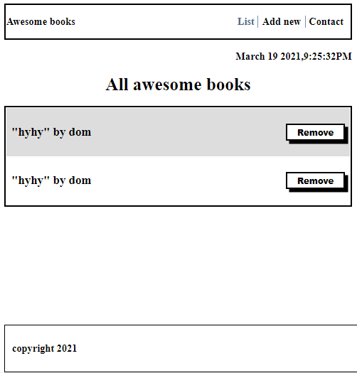

# AwesomeBooks

>This is a wesbite where you can add and remove books.




[Live Demo](https://mugishasam123.github.io/awesomebooks/)


## Built With

- Major languages (JavaScript)
- Technologies/tools used 

  
  ``` bash
 
  - Git(version control)
  - ESLint(JavaScript linting)
  - Stylelint(style linting)

  ```


## Getting Started

To get a local copy up and running follow these simple example steps.

### Prerequisites
 - A text editor(preferably Visual Studio Code)
### Install
  -  [Git](https://git-scm.com/downloads)
  -  [Node](https://nodejs.org/en/download/)
### Usage
#### Clone this repository

```bash
$ git clone https://github.com/mugishasam123/awesomebooks
.git
$ cd awesomebooks

```
#### Run project

```bash
$ npm install
$ npm start # this will open it in the browser and enable hot reloading
```

  <br>


## Authors

👤 **Matovu Farid Nkoba**

- GitHub: [@matovu-farid](https://github.com/matovu-farid)
- Twitter: [@matovu100](https://twitter.com/matovu100)
- LinkedIn: [matovu-farid](https://www.linkedin.com/in/matovu-farid-48b80257)

👤 **Mugisha Samuel**

- GitHub: [@mugishasamuel](https://github.com/mugishasam123)
- Twitter: [@mugishasamuel](https://twitter.com/mugishasamuel42/)
- LinkedIn: [mugishasamuel](https://www.linkedin.com/in/mugisha-samuel-55a905208/)


## 🤝 Contributing

Contributions, issues, and feature requests are welcome!

Feel free to check the [issues page](https://github.com/mugishasam123/awesomebooks/issues).

## Show your support

Give a ⭐️ if you like this project!

## Acknowledgments

- Hat tip to anyone whose code was used
- Inspiration
- etc
## 📝 License

This project is [MIT](https://opensource.org/licenses/MIT) licensed.
